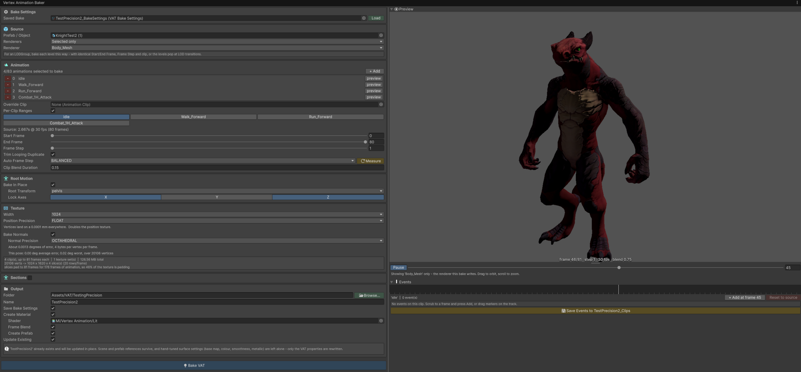
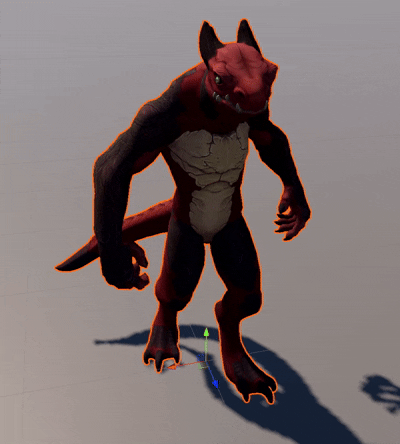
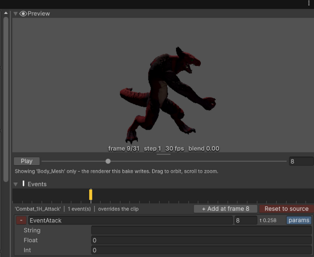
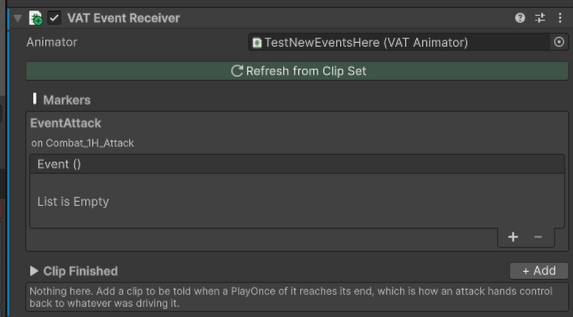
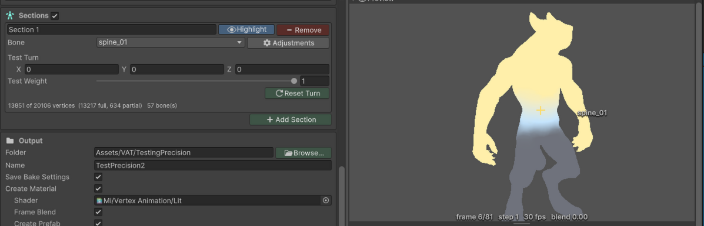
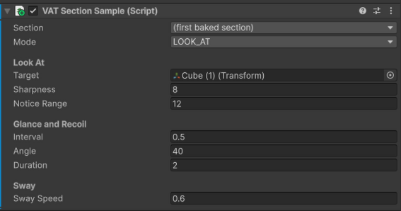

# MiVertexAnimation

Bakes a `SkinnedMeshRenderer` and its `AnimationClip`s into textures, so a crowd animates entirely on the GPU with no Animator, no bones and no per-frame CPU work.

Skinning hundreds of characters costs CPU time you cannot get back, and it is the same work every frame for animation that never changes. This bakes it once. What ships is a mesh, two textures and a material, and every instance plays from the same ones, so a hundred enemies are a hundred instances of one draw call.



> **The characters, textures and animations in these screenshots are not part of the package.** They
> are assets from a test project, shown to demonstrate the tool. What ships is the tool itself: the
> baker window, the runtime components and the shaders. The **Demo** sample adds a CC0 character and
> an idle clip, so there is something to bake on the first run.

## Contents

- [What you can do](#what-you-can-do) |Tthe short list of features
- [Requirements](#requirements) | Unity and render pipeline versions
- [Installation](#installation) | Adding the package
- [Baking](#baking) | The baker window, start to finish
- [Playing clips](#playing-clips) | Driving a baked prefab from code
- [Events](#events) | Markers on a baked clip, and reacting to them
- [Mesh sections](#mesh-sections) | Keeping part of the mesh drivable after the bake
- [Limits](#limits) | What it will not do
- [Roadmap](#roadmap) | What may come next
- [More detail](#more-detail) | Data layout, custom shaders, LOD, root motion
- [License](#license) | MIT, and the one asset that is not

## What you can do

- **Bake several clips at once** into one texture array, each with its own frame range and frame step.
- **Preview before baking**, with the real frame stepping and frame blending, so a setting that would ruin the animation shows up before it costs a bake.
- **Place animation events** on a track and have them fire at runtime, without an Animator.
- **Wire those events to UnityEvents** with no code, for the rest of the team.
- **Turn part of the mesh after the bake** - a head that looks at the player, a torso that leans, an arm that recoils.
- **Choose what precision costs you**, from vertex positions down to a hundredth of a millimetre to normals a hundred times finer than eight-bit at the same size.
- **Re-run any bake later** from the settings asset it wrote next to itself.

## Requirements

- Unity **6.3** (`6000.3`) or newer
- **Universal Render Pipeline**
- A rig with a `SkinnedMeshRenderer` and an `Animator`

## Installation

In Unity, open **Window > Package Manager**, click **+ > Add package from git URL**, and paste:

```
https://github.com/innocentmiau/MiVertexAnimation.git
```

To pin a version, add a tag: `...MiVertexAnimation.git#v1.0.0`

Or add it to `Packages/manifest.json` yourself:

```json
"com.andreleandrodev.mivertexanimation": "https://github.com/innocentmiau/MiVertexAnimation.git"
```

## Baking

Open **Tools > MiVertexAnimation > Baker**.

1. Drop a prefab into **Prefab / Object**.
2. Pick the clips to bake.
3. Set an output folder and a name.
4. Press **Bake**.

You get a prefab that plays, and the pieces it is made of:

| Written | What it is |
| --- | --- |
| `Name_Positions` | One vertex position per texel, one slice per clip |
| `Name_Normals` | The same for normals, unless Bake Normals is off |
| `Name.mat` | Points at both, and carries the frame counts and rates |
| `Name_Clips` | Which slice is which clip, plus its events and sections |
| `Name.prefab` | Mesh, material, correct animated bounds and a `VATAnimator` |
| `Name_BakeSettings` | Everything you chose, so the bake can be re-run |

Drop the prefab in a scene and it animates.




## Playing clips

```csharp
VATAnimator animator = GetComponent<VATAnimator>();

animator.Play("Walk");                 // cross-fades and loops
animator.PlayOnce("Attack", "Idle");   // plays once, then returns
animator.Snap("Idle");                 // no cross-fade
```

Clips are addressed by name, matched ignoring case, so reordering them in the baker cannot silently repoint your code.

## Events

Scrub the preview to a frame and press **Add at frame**. Events on the source clip are imported automatically, and anything you place in the baker wins over them.


*The character shown is not included - see the note at the top.*

```csharp
animator.ClipEventFired += (a, e) => { if (e.name == "Hit") DealDamage(); };
animator.ClipFinished   += (a, clip) => { if (clip == "Attack") Recover(); };
```

For people who would rather not write that, add a **VAT Event Receiver**: it lists the markers in the bake and gives each one a UnityEvent.




## Mesh sections

A VAT is frozen - every vertex is where the texture says. A section is the exception: a region that stays drivable afterwards.

Turn **Sections** on in the baker, add one, and pick a bone. The region comes from the rig's own skin weights, so the falloff down a neck is the one the rigger painted. **Highlight** paints it onto the preview and **Test Turn** moves it before you bake anything.


*The character shown is not included - see the note at the top.*

```csharp
VATSectionDriver driver = GetComponent<VATSectionDriver>();

driver.TurnTo("Head", new Vector3(0f, 35f, 0f), 0.4f);  // GPU walks the curve, nothing per frame
driver.LookAt("Head", player.position, 0.4f);
driver.Track("Head", driver.LookRotation("Head", player.position));  // follows a moving target
driver.Release("Head", 0.6f);
```

The **Demo** sample is a worked example of all four modes: import it from the Package Manager
(select MiVertexAnimation, then Samples > Demo > Import), bake the model it brings with it, and
drop the prefab onto the rig in the scene. Its own README has the four steps.


## Limits

- **16 clips** per bake, **4 sections** per bake.
- Vertex count times frame count has to fit a 16384 pixel texture. The window tells you before you bake.
- Blend shapes bake if they are animated. Cloth, particles and anything else driven outside the animation do not.
- Sections make the baker write its own copy of the mesh, so Unity 6 Mesh LOD does not survive a bake that uses them.

## Roadmap

Nothing here is promised or scheduled, it is what seems worth building next, roughly in order of how useful it would be. Suggestions and issues are welcome, and will move things around.

**Sections**

- **Chained sections.** A spine that drives a head that drives the eyes. Sections are independent today: where two overlap, priority decides which one owns a vertex, and neither inherits the other's rotation.
- **A warning when two baked clips share a name.** Clips are addressed by name at runtime, so two slices both called `Idle` cannot both be reached, and a one-shot ending on the second will not return to what it interrupted. The baker should say so before the bake rather than after.

**Baking**

- **Batch re-bake.** Every bake writes a settings asset next to its output, which is enough to reproduce it exactly, but nothing yet walks a folder of them after a shader change or a precision change and re-runs the lot.
- **Feedback when a bake finishes.** Right now the Project window does not move. Selecting and pinging what was written would say more than the console line does.
- **Preflight checks** gathered into one place, instead of warnings appearing as you happen to scroll past the setting that caused them.

**Rendering**

- **Alpha-clipped materials in the right queue.** The shader has an Alpha Clip toggle, but the passes stay tagged Opaque and Geometry, so cutout foliage or a cape sorts against other cutouts wrong.

## More detail

[Documentation~/MiVertexAnimation.md](Documentation~/MiVertexAnimation.md) covers how the data is laid out, how to add VAT to a shader you already have, the memory and precision options, LOD, root motion and the rest.

## License

[MIT](LICENSE.md) (c) André Leandro

The **Demo** sample includes a character from the [KayKit Character Pack](https://kaylousberg.com) by Kay Lousberg, released under [CC0 1.0](https://creativecommons.org/publicdomain/zero/1.0/) and redistributable on those terms. It is the only asset here not covered by the MIT license above, and it is recorded in `Samples~/Demo/Source/THIRD-PARTY.md`. Characters shown in the screenshots are not distributed with the package at all.
